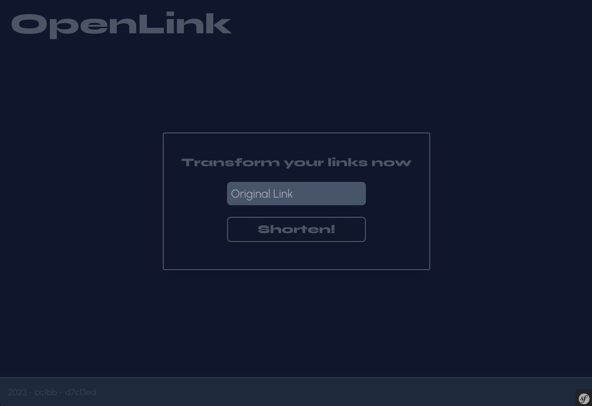
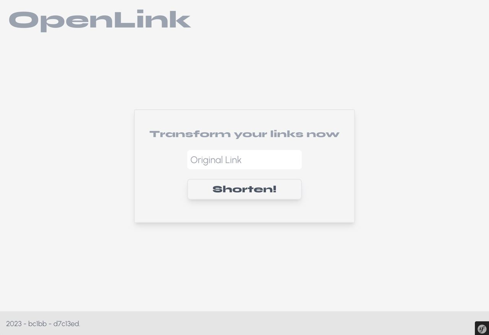

# OpenLink
(2023 rewrite)

OpenLink is a link shortener based on HiberLink. This is it's rewrote version in Symfony with Tailwind. It used to be made in bare PHP with handwritten CSS.

# TODO
- docker !
- prod-ready

## Setup
- `cp .env.example .env`
- edit .env
- `composer install`
- `php bin/console doctrine:migrations:migrate`
- `npm install`
- `npm run build`
- `composer dump-env prod`
- [dev]: symfony server:start